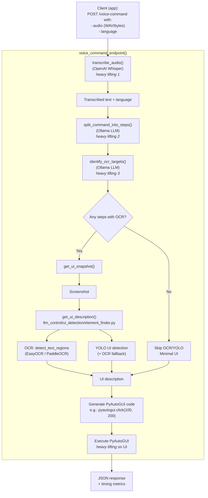

# 🤖 LLM PC Control

[](https://github.com/pnmartinez/simple-computer-use/actions/workflows/voice-server-verification.yml)

> For voice control with phone check: https://github.com/pnmartinez/computer-use-android-app

[demo.webm](https://github.com/user-attachments/assets/bdd5bc25-fe88-4105-a3ed-f435f98e4f18)

Control your computer with natural language commands using Large Language Models (LLMs), OCR, and voice input. All options are exposed in the Electron GUI.


> Get the Android app to control your PC with voice on the [Computer Use Android App](https://github.com/pnmartinez/computer-use-android-app) repo.


## ✨ Features

- 🗣️ **Natural Language Commands**: Control your computer using everyday language
- 🔍 **UI Element Detection**: Automatically detects UI elements on your screen
- 📝 **Multi-Step Commands**: Execute complex sequences of actions with a single command
- 👁️ **OCR Integration**: Reads text from your screen to better understand the context
- ⌨️ **Keyboard and Mouse Control**: Simulates keyboard and mouse actions
- 🎤 **Voice Input Support**: Control your PC with voice commands
- 🌎 **Multilingual Support**: Automatic translation with preservation of UI element names
- 🖥️ **AppImage Distribution**: Easy-to-use AppImage package for Linux

## 🚀 Installation

### Standard Installation

```bash
# Clone the repository
git clone https://github.com/yourusername/llm-pc-control.git
cd llm-pc-control

# Install the package
pip install -e .
```


## 📋 Requirements

### Quick Requirements
- Python 3.11 or 3.12
- Ollama (for local LLM inference) - included in AppImage
- Linux x86_64 (64-bit)
- 16 GB RAM minimum (32 GB or 64 GB recommended)
- 15 GB free disk space (30 GB recommended)
- GPU optional but recommended (NVIDIA with 4+ GB VRAM)

### Detailed System Requirements

For complete system specifications including minimum, recommended, and optimal configurations, see **[System Requirements Guide](docs/system-requirements.md)**.

The guide includes:
- Detailed RAM, CPU, and GPU requirements
- Storage space recommendations
- Operating system dependencies
- Resource usage by component
- Recommended configurations for different use cases
- Troubleshooting tips for limited systems

## 📖 Usage

### Voice Control Server

```bash
# Run the voice control server
python -m llm_control voice-server

# With custom options
python -m llm_control voice-server --port 8080 --whisper-model medium --ollama-model llama3.1
```

### Simple Command

```bash
# Run a simple command
python -m llm_control simple-voice --command "click on the Firefox icon"
```

## 🖥️ Server API

The voice control server provides the following API endpoints:

- **GET /health**: Check server status
- **POST /command**: Execute a text command
- **POST /voice-command**: Process a voice command from audio data
- **POST /transcribe**: Transcribe audio without executing commands
- **POST /translate**: Translate text to English

### Example: Sending a Direct Command

```bash
curl -X POST http://localhost:5000/command \
  -H "Content-Type: application/json" \
  -d '{"command": "open Firefox, go to gmail.com and compose a new email"}'
```

### Example: Sending a Voice Command

```bash
curl -X POST http://localhost:5000/voice-command \
  -F "audio_file=@recording.wav" \
  -F "translate=true" \
  -F "language=es"
```

### 🧭 Data flow for the `/voice-command` endpoint



**Where the heavy lifting happens**

- **Transcription:** Whisper processes audio and returns text + segments.
- **Command reasoning:** Ollama (configurable model) splits the command, identifies targets, and generates actions.
- **Visual perception (when needed):** YOLO/OCR and vision models provide UI context for visual-target steps.

## 🧪 Project Structure

```
llm-control/
├── llm_control/         # Main Python package
├── scripts/             # Utility scripts
│   ├── setup/           # Installation scripts
│   └── tools/           # Utility tools
├── data/                # Data files
├── tests/               # Test suite
└── screenshots/         # Screenshots directory
```

## 💡 Command Examples

Here are some examples of commands you can use:

- "Click on the Submit button"
- "Type 'Hello, world!' in the search box"
- "Press Enter"
- "Move to the top-right corner of the screen"
- "Double-click on the file icon"
- "Right-click on the image"
- "Scroll down"
- "Click on the button, then type 'Hello', then press Enter"

## ⚙️ How It Works

1. 📸 **Screenshot Analysis**: Takes a screenshot of your screen
2. 🔎 **UI Detection**: Analyzes the screenshot to detect UI elements
3. 🔄 **Command Parsing**: Parses your natural language command into steps
4. ⚡ **Action Generation**: Generates the corresponding actions for each step
5. ▶️ **Execution**: Executes the actions using PyAutoGUI

## 📊 Structured Usage Logging

The application supports structured JSON logging to track which parts of the logic are being used. This is useful for analyzing usage patterns, identifying unused code paths, and debugging execution flows.

### Enabling Structured Logging

Set the `STRUCTURED_USAGE_LOGS` environment variable to enable structured logging:

```bash
export STRUCTURED_USAGE_LOGS=true
python -m llm_control voice-server
```

Or when running the server:

```bash
STRUCTURED_USAGE_LOGS=true python -m llm_control voice-server
```

**Log File Persistence:**

When structured logging is enabled, events are automatically saved to a JSONL (JSON Lines) file in addition to being logged to stdout/journal. By default, logs are saved to:

```
./structured_logs/structured_events_YYYYMMDD.jsonl
```

You can customize the log directory by setting the `STRUCTURED_LOGS_DIR` environment variable:

```bash
export STRUCTURED_USAGE_LOGS=true
export STRUCTURED_LOGS_DIR=/path/to/logs
python -m llm_control voice-server
```

Each day gets its own log file (format: `structured_events_YYYYMMDD.jsonl`), making it easy to analyze usage patterns over time.

### Log Events

When enabled, the following structured events are logged:

#### Command Processing Events
- `command_step_start`: When a command step begins processing
- `command_step_complete`: When a step completes successfully
- `command_step_error`: When a step encounters an error
- `command_action_type`: The type of action being executed (click, type, scroll, keyboard, reference)

#### UI Detection Events
- `ui_element_search_start`: When searching for a UI element
- `ui_element_search_success`: When an element is found
- `ui_element_search_no_match`: When no matching element is found
- `ui_element_search_failed`: When search fails due to missing data
- `ui_detection_start`: When UI detection begins
- `ui_detection_complete`: When UI detection finishes
- `ui_detection_yolo_complete`: When YOLO detection completes

### Example Log Entries

```json
{"event": "command_step_start", "step": "click on the button", "step_number": 1}
{"event": "ui_element_search_start", "query": "button", "elements_count": 15}
{"event": "ui_element_search_success", "query": "button", "selected_match": {"type": "button", "text": "Submit", "coordinates": {"x": 500, "y": 300}, "score": 85.5}}
{"event": "command_action_type", "action_type": "click", "target": "button", "coordinates": {"x": 500, "y": 300}}
{"event": "command_step_complete", "step": "click on the button", "success": true}
```

### Analyzing Logs

You can parse and analyze the structured logs using standard JSON tools:

**From the structured log file (recommended):**

```bash
# Extract all UI element searches
cat structured_logs/structured_events_*.jsonl | jq -r 'select(.data.event == "ui_element_search_success")'

# Count action types
cat structured_logs/structured_events_*.jsonl | jq -r 'select(.data.event | startswith("command.")) | .data.event' | sort | uniq -c

# Find failed searches
cat structured_logs/structured_events_*.jsonl | jq -r 'select(.data.event == "ui_element_search_no_match")'

# Analyze today's events
cat structured_logs/structured_events_$(date +%Y%m%d).jsonl | jq .
```

**From the main log file:**

```bash
# Extract all UI element searches
grep "ui_element_search" llm-control.log | jq .

# Count action types
grep "command_action_type" llm-control.log | jq -r '.action_type' | sort | uniq -c

# Find failed searches
grep "ui_element_search_no_match" llm-control.log | jq .
```

The structured log files (`.jsonl` format) contain one JSON object per line, making them easy to process with tools like `jq`, `grep`, or custom analysis scripts.

## 🛠️ Building from Source

To build the AppImage or other distribution packages from source, see the **[Build Guide](README-BUILD.md)**.

The build process includes:
- Downloading Ollama binaries for packaging
- Building the Python backend with PyInstaller
- Creating the Electron AppImage/DMG/installer

Quick start:
```bash
# Clone and setup
git clone <repository-url>
cd llm-control
npm install
cd gui-electron && npm install && cd ..

# Install Python dependencies
pip install -r requirements.txt
pip install pyinstaller

# Build everything
npm run build:all
```

## 📄 License

This project is licensed under the MIT License - see the LICENSE file for details.
