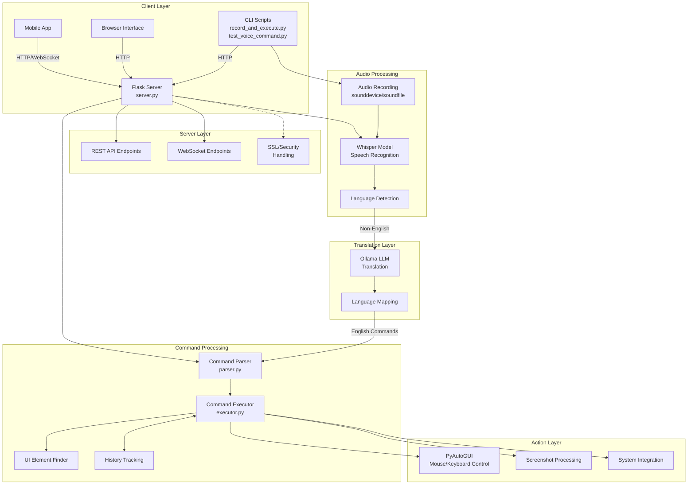
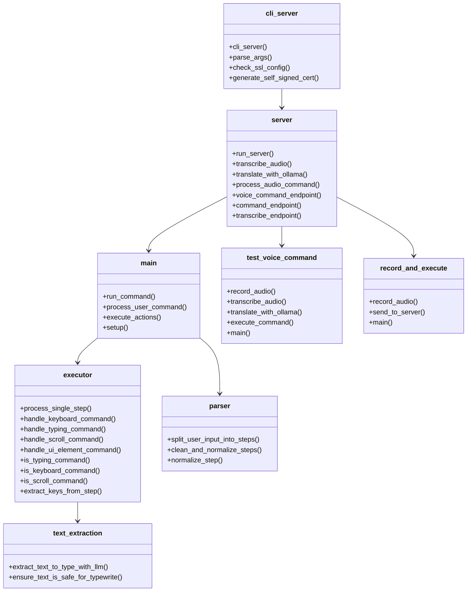
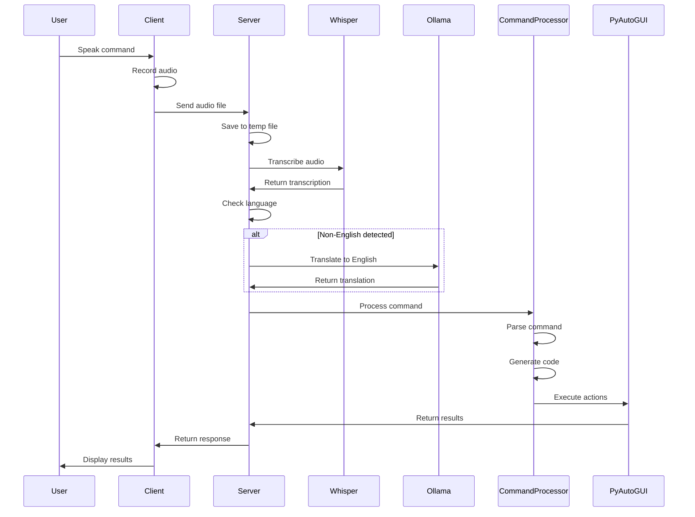
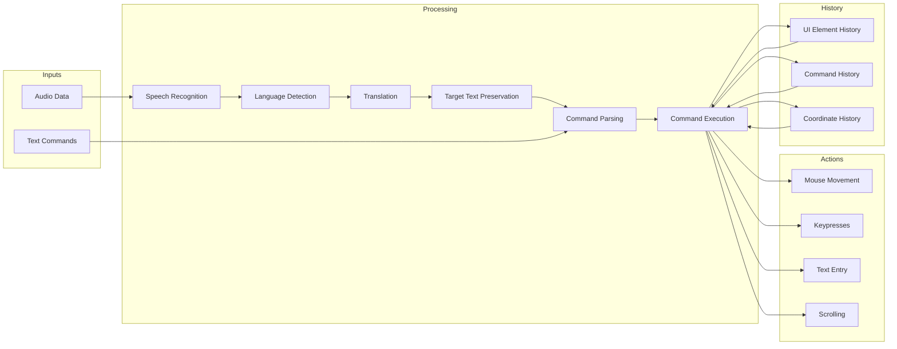
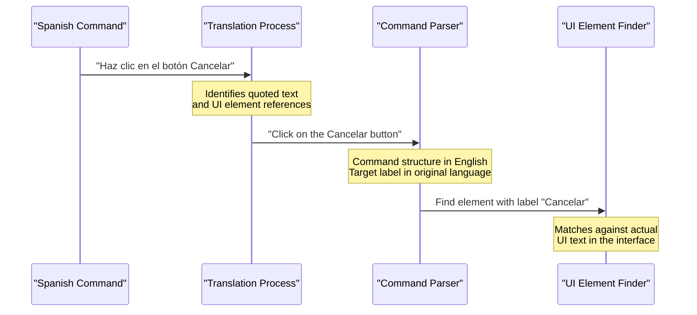

# LLM PC Control Architecture Diagram

## System Overview



## Module Structure



## Audio Processing Flow



## Data Flow Diagram



## Target Text Preservation



A critical aspect of multilingual command processing is preserving target text elements in their original language. When a user references UI elements in their commands, those references must remain untranslated to match what actually appears on screen.

### Examples:
| Original Command | Incorrect Translation | Correct Translation |
|------------------|------------------------|---------------------|
| "Haz clic en Guardar" | "Click on Save" | "Click on Guardar" |
| "Escribir 'Hola' en Mensaje" | "Type 'Hello' in Message" | "Type 'Hola' in Mensaje" |
| "Selecciona Archivo" | "Select File" | "Select Archivo" |

This requirement is implemented in the translation process by:
1. Instructing the LLM translator to preserve quoted text
2. Preserving UI element names, button labels, and menu items
3. Maintaining file paths and technical terms in their original form

## File Organization

```
llm-control/
├── llm_control/                     # Main package
│   ├── __init__.py                  # Constants and configurations
│   ├── server.py                    # Main server functionality
│   ├── main.py                      # Core command processing
│   ├── cli_server.py                # CLI server entry point
│   ├── command_processing/          # Command processing modules
│   │   ├── executor.py              # Execute user commands
│   │   ├── parser.py                # Parse user input
│   │   ├── finder.py                # Find UI elements
│   │   └── history.py               # Track command history
│   ├── llm/                         # LLM integration modules
│   │   ├── text_extraction.py       # Extract text for typing
│   │   └── intent_detection.py      # Detect user intent
│   └── utils/                       # Utility modules
│       ├── dependencies.py          # Dependency management
│       └── screenshot.py            # Screenshot handling
├── record_and_execute.py            # Record & send to server
├── test_voice_command.py            # Standalone testing tool
├── start_android_server_rest.py     # Android REST API server
└── README.md                        # Documentation
```

## Key Interfaces

### REST API Endpoints

| Endpoint | Method | Description |
|----------|--------|-------------|
| `/health` | GET | Health check |
| `/transcribe` | POST | Audio transcription only |
| `/command` | POST | Execute text command |
| `/voice-command` | POST | Process voice command |
| `/api/info` | GET | Server capabilities |
| `/api/system-info` | GET | System information |

### Command Line Arguments

| Argument | Description |
|----------|-------------|
| `--whisper-model` | Whisper model size (tiny/base/small/medium/large) |
| `--language` | Expected language (default: es) |
| `--disable-translation` | Disable automatic translation |
| `--ollama-model` | Ollama model for translation |
| `--ollama-host` | Ollama API host |

## Areas for Potential Refactoring

1. **Separation of Concerns**
   - Server functionality is tightly coupled with audio processing
   - Command execution mixed with UI detection

2. **Code Duplication**
   - Audio recording logic duplicated across files
   - Translation logic appears in multiple places

3. **Configuration Management**
   - Environment variables, command-line args, and constants spread across files
   - No central configuration system

4. **Error Handling**
   - Inconsistent error handling patterns
   - Some functions return None on error, others raise exceptions

5. **Testing Infrastructure**
   - Limited unit testing
   - Manual test scripts that could be automated

6. **Language Support**
   - Spanish support added in multiple places
   - Could be centralized into language modules

7. **Documentation**
   - Scattered across various files
   - No centralized API documentation

8. **Dependency Management**
   - Manual checks for dependencies
   - No formal dependency specification (requirements.txt/pyproject.toml) 